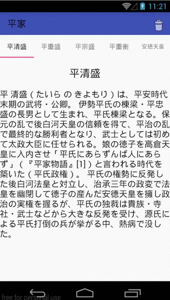

[  ](https://bintray.com/numa08/maven/dynamicfragmentpageradapter/_latestVersion)



# Immutable Fragment Pager Adapter

このライブラリは ViewPager を利用したとき任意の位置にある Fragment の削除/追加/入れ替えを可能にします。

## 詳細

Android の Support Library や SDK が提供している FragmentStatePagerAdapter は、末尾への Fragment の追加や削除はサポートしますが、それ以外はサポートしません。できないこともないですが、パフォーマンス上あまりよくないです。

このライブラリでは好きな位置への追加や削除を可能にし、更に高いパフォーマンスを維持します。

## 導入方法

`build.gradle` に以下のコードを書いてください。

```gradle
dependencies {
    compile 'net.numa08:dynamicfragmentpageradapter:0.7.0'
}
```