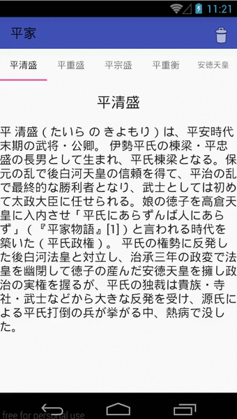

[  ](https://bintray.com/numa08/maven/dynamicfragmentpageradapter/_latestVersion)



# Immutable Fragment Pager Adapter

This library is able to remove, add and swap specify Fragment when you use ViewPager.

## Description

FragmentStateViewPager that is provided by Android SDK or Support Library can only remove or add Fragment to last position. If you do that bad performance...

THis library can do that and have good performance.

## Installation

You write below code in your `build.gradle`


```gradle
dependencies {
    compile 'net.numa08:dynamicfragmentpageradapter:0.6.1'
}
```